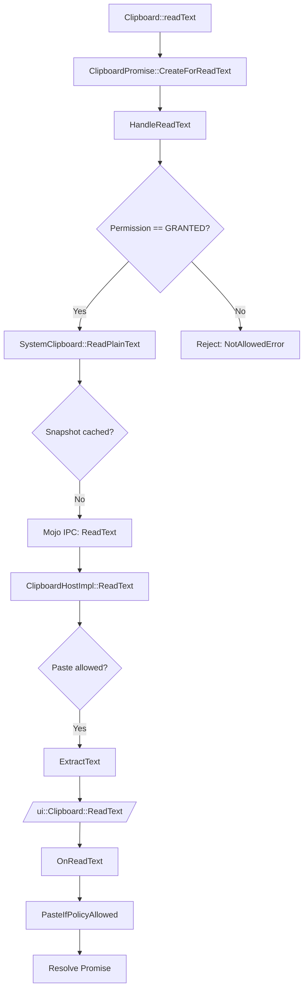

# CodeGraph CLI Reference

Complete reference for all `codegraph` commands. The CLI is designed to be both human-friendly (colored, interactive) and AI-friendly (structured `--format json` output).

---

## Quick Reference

| Command | Description |
|---------|-------------|
| `codegraph` | Launch interactive explorer (no args) |
| `codegraph init` | Initialize a new CodeGraph project |
| `codegraph index <dir>` | Parse and index a codebase into Neo4j |
| `codegraph explore` | Interactive menu-driven exploration |
| `codegraph discover` | AI-powered scenario discovery |
| `codegraph scenarios` | List all scenarios |
| `codegraph trace <id>` | Trace a scenario's execution path |
| `codegraph walk <id>` | Interactive step-by-step walkthrough |
| `codegraph view <id>` | Rich scenario viewer |
| `codegraph correct <id>` | Submit a human correction |
| `codegraph query` | Query the code graph |
| `codegraph functions` | Browse and search functions |
| `codegraph export <id>` | Export scenario (JSON/Markdown/Mermaid) |
| `codegraph import <file>` | Import a scenario from JSON |
| `codegraph diff <id>` | Compare scenario versions |
| `codegraph serve` | Start API server + Web UI |
| `codegraph stats` | Show graph database statistics |
| `codegraph doctor` | System health check |

---

## Global Options

```
-c, --config <path>    Path to .codegraph.yaml or project root
-v, --verbose          Enable verbose output
-V, --version          Output version number
-h, --help             Display help for command
```

---

## Commands

### `codegraph` (no arguments)

Launches the **interactive explorer** — a menu-driven interface for accessing all CodeGraph features without remembering command syntax.

```
$ codegraph

╔══════════════════════════════════════════════════════════════╗
║  CodeGraph Explorer                                         ║
╚══════════════════════════════════════════════════════════════╝

? What would you like to do?
  ❯ 🔍 Search functions
    📋 Browse scenarios
    🌳 View call graph for a function
    🔄 Discover new scenarios (AI)
    📊 View graph statistics
    🏥 System health check
    ❌ Exit
```

Use `--mock` flag to run in demo mode without Neo4j.

---

### `codegraph init`

Initialize a new CodeGraph project in the current directory.

```bash
codegraph init [options]

Options:
  --lang <language>    Primary language: ts, cpp (default: "ts")
  --neo4j <uri>        Neo4j connection URI (default: "bolt://localhost:7687")
  --name <name>        Project name (default: directory name)
```

**Example:**
```bash
# Initialize a TypeScript project
codegraph init --lang ts --name my-app

# Initialize for Chromium C++ code
codegraph init --lang cpp --neo4j bolt://localhost:7687 --name chromium
```

Creates `.codegraph.yaml` in the current directory with sensible defaults.

---

### `codegraph index <directory>`

Parse source files and write the code structure to Neo4j.

```bash
codegraph index <directory> [options]

Options:
  --incremental        Only re-parse files that changed
  --include-deps       Also index imported dependencies
```

**Example:**
```bash
# Index a TypeScript project
codegraph index ./src

# Index specific Chromium subsystem
codegraph index src/content/browser/renderer_host --include-deps

# Incremental re-index after code changes
codegraph index ./src --incremental
```

**Output:**
```
⠹ Indexing src/...
✔ Indexed 247 files in 12.3s
  Functions: 3,421
  Classes:   189
  Calls:     12,847
  Branches:  8,932
```

---

### `codegraph explore`

Interactive menu-driven exploration of the code graph. This is the recommended way to use CodeGraph interactively.

```bash
codegraph explore [options]

Options:
  --mock    Use mock data (no Neo4j required, great for demos)
```

**Features:**
- 🔍 **Search functions** — fuzzy search, view details, callers, callees
- 📋 **Browse scenarios** — list, filter by status, start walkthrough
- 🌳 **View call graph** — tree-formatted callers and callees for any function
- 🔄 **Discover scenarios** — AI-powered scenario discovery with hints
- 📊 **Statistics** — graph node/edge counts
- 🏥 **Health check** — verify Neo4j, AI config, etc.

**Example session:**
```
$ codegraph explore --mock

╔═══════════════════════════════════════╗
║  CodeGraph Explorer                   ║
╚═══════════════════════════════════════╝

Choose an action:
  1) 🔍 Search functions
  2) 📋 Browse scenarios
  3) 🌳 View call graph for a function
  4) 🔄 Discover new scenarios (AI)
  5) 📊 View graph statistics
  6) 🏥 System health check
  7) ❌ Exit

Choice: 1

🔍 Enter search term: handleFile

  # │ Function                             │ File                 │ Line
 ───┼──────────────────────────────────────┼──────────────────────┼──────
  1 │ FileProcessingPipeline.handleFileDrop│ src/pipeline.ts      │ 25
  2 │ handleUserFileDrop                   │ src/index.ts         │ 10

Select function (number): 1

📄 FileProcessingPipeline.handleFileDrop
   File: src/pipeline.ts:25-67
   Signature: handleFileDrop(files: FileData[]): Promise<ProcessResult[]>
   Async: yes  Exported: no  Visibility: public

   Callers (2):
     └─ handleUserFileDrop (src/index.ts:10)
     └─ FileDropEventHandler.handle (src/events.ts:15)

   Callees (4):
     ├─ SizeValidator.validate
     ├─ TypeValidator.validate
     ├─ ImageProcessor.process
     └─ DocumentProcessor.process

   Scenarios (1):
     └─ user-drops-file (✅ validated, 47 steps)
```

---

### `codegraph discover`

Use AI to discover realistic usage scenarios from the indexed codebase.

```bash
codegraph discover [options]

Options:
  --hint <text>      Guide AI discovery (e.g., "file drag and drop")
  --count <n>        Max scenarios to discover (default: 5)
  --entry <fn>       Start from a specific entry function
```

**Example:**
```bash
# Discover scenarios related to clipboard
codegraph discover --hint "clipboard read text" --count 3

# Discover from a specific entry point
codegraph discover --entry "Clipboard::readText"
```

**Output:**
```
🔄 Discovering scenarios...

Found 3 scenarios:
  # │ ID                      │ Name                                  │ Confidence
 ───┼─────────────────────────┼───────────────────────────────────────┼───────────
  1 │ clipboard-read-text     │ Web page reads clipboard text         │ 0.95
  2 │ clipboard-paste-event   │ User pastes text into input field     │ 0.88
  3 │ clipboard-write-text    │ Web page writes to clipboard          │ 0.85

Use 'codegraph trace <id>' to trace a scenario.
```

---

### `codegraph scenarios`

List all scenarios with their status.

```bash
codegraph scenarios [options]

Options:
  --status <status>    Filter by: draft, traced, validated, corrected
  --format <fmt>       Output format: table, json (default: "table")
```

**Example:**
```bash
codegraph scenarios --status traced --format table
```

---

### `codegraph trace <scenario-id>`

Trace a scenario's full execution path using AI.

```bash
codegraph trace <scenario-id> [options]

Options:
  --max-depth <n>     Max call depth (default: 50)
```

**Example:**
```bash
codegraph trace clipboard-read-text --max-depth 30
```

**Output:**
```
⠹ Tracing scenario "clipboard-read-text"...
  Entry: Clipboard::readText
  ✔ Traced 15 steps across 8 functions
    Branch decisions: 3 (AI)
    Virtual dispatches: 1 resolved
    Duration: 4.2s

Use 'codegraph walk clipboard-read-text' for step-by-step walkthrough.
```

---

### `codegraph walk <scenario-id>`

Interactive step-by-step walkthrough of a traced scenario. Shows source code, variable state, AI justification, and accepts corrections.

```bash
codegraph walk <scenario-id>
```

**REPL Commands:**

| Command | Shortcut | Description |
|---------|----------|-------------|
| `next` | `n` | Go to next step |
| `prev` | `p` | Go to previous step |
| `jump <n>` | `j <n>` | Jump to step number |
| `vars` | `v` | Show current variable state |
| `why` | `w` | Show full AI justification |
| `correct` | `c` | Enter correction mode |
| `source` | `s` | Show full function source |
| `graph` | `g` | Show call stack at this point |
| `quit` | `q` | Exit walkthrough |

**Example session:**
```
$ codegraph walk async-clipboard-read-text

╔═══════════════════════════════════════════════════════════════╗
║  Walkthrough: Async Clipboard readText() API Call             ║
║  Step 4 / 15                                                  ║
╚═══════════════════════════════════════════════════════════════╝

📍 ClipboardPromise::HandleReadTextWithPermission
📁 clipboard_promise.cc:490

  490│ void ClipboardPromise::HandleReadTextWithPermission(
  491│     mojom::blink::PermissionStatus status) {
  492│   if (status != mojom::blink::PermissionStatus::GRANTED) {
  493│     script_promise_resolver_->RejectWithDOMException(
  494│         DOMExceptionCode::kNotAllowedError, ...);
  495│     return;
  496│   }
  497│ ▶ // Permission granted — proceed with read

  ┌─ Action: branch_taken ──────────────────────────────────────┐
  │ 🤖 Permission status == GRANTED. The user has already       │
  │    granted clipboard-read permission to this origin.        │
  │ Confidence: 0.95                                            │
  └─────────────────────────────────────────────────────────────┘

  Variables: status = GRANTED

codegraph> n
```

---

### `codegraph view <scenario-id>`

Rich non-interactive scenario viewer with multiple output formats.

```bash
codegraph view <scenario-id> [options]

Options:
  --step <n>          Show detail for a specific step
  --format <fmt>      Output: table, detail, json (default: "table")
```

**Examples:**
```bash
# Table view of all steps
codegraph view async-clipboard-read-text

# Detailed view of step 8 (the Mojo IPC call)
codegraph view async-clipboard-read-text --step 8 --format detail

# JSON output for AI consumption
codegraph view async-clipboard-read-text --format json
```

**Table output:**
```
Scenario: Async Clipboard readText() API Call
Status: traced │ Confidence: 0.95 │ Steps: 15
Entry: Clipboard::readText

  #  │ Function                                │ Action        │ Line │ Confidence
 ────┼─────────────────────────────────────────┼───────────────┼──────┼───────────
   1 │ Clipboard::readText                     │ call          │   46 │ 1.00
   2 │ ClipboardPromise::CreateForReadText     │ call          │  126 │ 0.98
   3 │ ClipboardPromise::HandleReadText        │ call          │  286 │ 0.98
   4 │ HandleReadTextWithPermission            │ branch_taken  │  490 │ 0.95
   5 │ HandleReadTextWithPermission            │ branch_skip   │  510 │ 0.90
   6 │ SystemClipboard::ReadPlainText          │ call          │  112 │ 0.95
   7 │ SystemClipboard::ReadPlainText          │ branch_skip   │  115 │ 0.88
   8 │ SystemClipboard::ReadPlainText (Mojo)   │ call          │  120 │ 0.98
   9 │ ClipboardHostImpl::ReadText             │ call          │  231 │ 0.95
  10 │ ClipboardHostImpl::ReadText             │ branch_taken  │  235 │ 0.92
  11 │ ClipboardHostImpl::ExtractText          │ call          │ 1030 │ 0.93
  12 │ ui::Clipboard::ReadText                 │ dispatch      │    0 │ 0.90
  13 │ ClipboardHostImpl::OnReadText           │ call          │  245 │ 0.93
  14 │ PasteIfPolicyAllowed callback           │ call          │  260 │ 0.92
  15 │ ClipboardPromise (Promise Resolution)   │ return        │  520 │ 0.95
```

---

### `codegraph correct <scenario-id>`

Submit a natural-language correction to a scenario.

```bash
codegraph correct <scenario-id> [options]

Options:
  --step <n>          Step number to correct
  --message <text>    Correction message
```

**Examples:**
```bash
# Override a branch decision
codegraph correct async-clipboard-read-text --step 5 \
  --message "On macOS, this branch IS taken because the flag is enabled by default"

# Add a variable constraint
codegraph correct async-clipboard-read-text --step 7 \
  --message "The snapshot cache is always populated after the first read"

# Override virtual dispatch
codegraph correct async-clipboard-read-text --step 12 \
  --message "On Windows, this dispatches to ClipboardWin, not ClipboardOzone"
```

---

### `codegraph query`

Query the code graph directly.

```bash
codegraph query callers <function-name>    # Who calls this function?
codegraph query callees <function-name>    # What does this function call?
codegraph query path --from <fn> --to <fn> # Find call paths between functions
```

**Examples:**
```bash
codegraph query callers "FileProcessingPipeline.handleFileDrop"
codegraph query callees "handleUserFileDrop"
codegraph query path --from "handleUserFileDrop" --to "ImageProcessor.process"
```

---

### `codegraph functions`

Browse and search indexed functions.

```bash
codegraph functions [options]

Options:
  --search <query>    Search by name (fuzzy)
  --file <path>       Filter by file path
  --class <name>      Filter by class name
  --format <fmt>      Output: table, json (default: "table")
```

**Examples:**
```bash
# Search for clipboard-related functions
codegraph functions --search clipboard

# List all functions in a file
codegraph functions --file src/pipeline.ts

# JSON output for AI consumption
codegraph functions --search "readText" --format json
```

---

### `codegraph export <scenario-id>`

Export a scenario to various formats.

```bash
codegraph export <scenario-id> [options]

Options:
  --format <fmt>    json, markdown, mermaid, cypher (default: "json")
  --output <file>   Output file (default: stdout)
```

**Examples:**
```bash
# Export as JSON (for sharing or AI consumption)
codegraph export async-clipboard-read-text --format json > scenario.json

# Export as Markdown report
codegraph export async-clipboard-read-text --format markdown --output report.md

# Export as Mermaid flowchart (paste into GitHub markdown)
codegraph export async-clipboard-read-text --format mermaid

# Export as Cypher queries (for recreating in another Neo4j)
codegraph export async-clipboard-read-text --format cypher
```

**Mermaid output example:**


---

### `codegraph import <file>`

Import a scenario from a JSON file.

```bash
codegraph import <file.json>
```

**Example:**
```bash
# Import the Chromium clipboard scenario
codegraph import scenarios/async-clipboard-read-text.json

# Import a scenario shared by a teammate
codegraph import ~/shared/drop-file-scenario.json
```

---

### `codegraph diff <scenario-id>`

Compare versions of a scenario after corrections.

```bash
codegraph diff <scenario-id> [options]

Options:
  --v1 <n>    First version (default: current - 1)
  --v2 <n>    Second version (default: current)
```

---

### `codegraph serve`

Start the API server and Web UI.

```bash
codegraph serve [options]

Options:
  --port <n>     Port number (default: 3000)
  --host <addr>  Host address (default: "127.0.0.1")
```

**Example:**
```bash
codegraph serve --port 3000
# API:     http://localhost:3000/api
# GraphQL: http://localhost:3000/graphql
# Web UI:  http://localhost:3000
```

---

### `codegraph stats`

Show graph database statistics.

```bash
codegraph stats [--format json]
```

**Output:**
```
📊 Graph Statistics
  Files indexed:    247
  Functions:        3,421
  Classes:          189
  Call edges:       12,847
  Branches:         8,932
  Variables:        15,203
  Scenarios:        5 (3 traced, 2 draft)
  Corrections:      12
```

---

### `codegraph doctor`

Run system health checks.

```bash
codegraph doctor
```

**Output:**
```
🏥 CodeGraph Health Check
  ✅ Node.js:    v20.11.0 (≥ 20 required)
  ✅ Neo4j:      Connected (bolt://localhost:7687)
  ✅ Database:   "neo4j" — 3,421 functions indexed
  ⚠️  AI API:    Mock mode (set CODEGRAPH_AI_API_KEY for real AI)
  ❌ clangd:     Not found (required for C++ parsing)
  ✅ Config:     .codegraph.yaml found
```

---

## AI-Friendly Usage

All commands support `--format json` for structured output that AI tools can consume:

```bash
# Get scenario data as JSON
codegraph view my-scenario --format json | ai-tool analyze

# Search functions and pipe to AI
codegraph functions --search "auth" --format json

# Export full scenario for AI analysis
codegraph export my-scenario --format json
```

### Using with AI Chat (e.g., Copilot)

```
You: Show me the clipboard readText scenario
AI:  codegraph view async-clipboard-read-text --format json

You: What happens at step 8?
AI:  codegraph view async-clipboard-read-text --step 8 --format detail

You: Actually, on macOS the platform permission check IS taken
AI:  codegraph correct async-clipboard-read-text --step 5 \
       --message "On macOS, this branch IS taken"

You: Show me the updated scenario
AI:  codegraph view async-clipboard-read-text --format json
```

---

## Environment Variables

| Variable | Description | Default |
|----------|-------------|---------|
| `CODEGRAPH_AI_API_KEY` | OpenAI API key for AI features | (mock mode) |
| `CODEGRAPH_NEO4J_PASSWORD` | Neo4j password | `codegraph` |
| `CODEGRAPH_LOG_LEVEL` | Log level: debug, info, warn, error | `info` |
| `CODEGRAPH_SILENT` | Suppress all logs | `false` |
| `CODEGRAPH_LOG_JSON` | Output logs as JSON | `false` |

---

## Example Workflow: Chromium Clipboard readText

```bash
# 1. Initialize project
cd chromium/src
codegraph init --lang cpp --name chromium

# 2. Index clipboard subsystem
codegraph index third_party/blink/renderer/modules/clipboard \
  --include-deps

# 3. Import pre-built scenario
codegraph import scenarios/async-clipboard-read-text.json

# 4. View the scenario
codegraph view async-clipboard-read-text

# 5. Walk through step by step
codegraph walk async-clipboard-read-text

# 6. Correct a decision at step 5 (macOS branch)
codegraph correct async-clipboard-read-text --step 5 \
  --message "On macOS, the platform permission check IS enabled"

# 7. Export as Mermaid for documentation
codegraph export async-clipboard-read-text --format mermaid > clipboard-flow.md

# 8. Start web UI for visual exploration
codegraph serve --port 3000
```
